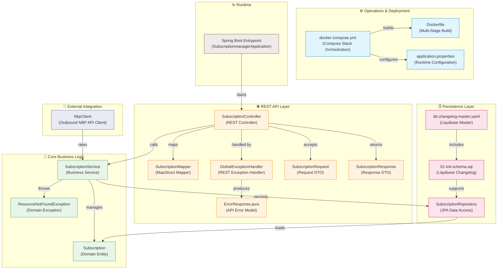

# 💳 SubManager REST API

Welcome to **SubManager**, a production-ready Spring Boot REST API built to track monthly subscriptions, manage costs, and automatically convert/aggregate expenses into a single consolidated currency (PLN) using live exchange rates.

This project is meticulously designed following clean code principles, strict DTO patterns, robust global exception handling, database migrations, and advanced containerization. It serves as a **professional portfolio project** demonstrating modern Java backend engineering.

---

## 🚀 Key Architectural & Technical Features

- **☕ Java 17 & Spring Boot 3/4**: Utilizes the modern, reactive features of Java 17 combined with a fast, high-performance Spring web stack.
- **🔄 Zero-Overhead DTO Mapping (MapStruct)**: Implements standard separation of concerns by utilizing MapStruct for highly efficient, compile-time type-safe DTO-to-Entity conversion.
- **🗄️ Database Migrations (Liquibase)**: Employs database versioning using Liquibase rather than unstable schema auto-generation. Schema definitions are tracked in structured SQL changesets.
- **🛡️ Validation & Constraints**: Enforces strict payload validation (`@NotBlank`, `@Positive`, `@FutureOrPresent`) via Jakarta Bean Validation and Hibernate Validator to guarantee data sanity.
- **🌐 Resilient Exchange-Rate Client (NBP API)**: Integrated with the **National Bank of Poland (NBP)** API to fetch live rates. Features a robust **offline fallback mechanism** that logs warnings and falls back to safe predefined exchange rates (USD=4.00, EUR=4.30) if the API is down or the server is offline.
- **🚨 Centralized Global Exception Handling**: Features a dedicated `@RestControllerAdvice` controller that intercepts all runtime exceptions, converting them into standardized, clean, developer-friendly JSON error payloads.
- **🐳 Multi-Stage Docker & Compose**: Built using a space-saving, two-stage Docker build pipeline (Maven compilation → Eclipse Temurin JRE runtime) and orchestated using a single-click Docker Compose config.
- **🧪 Comprehensive Unit Testing**: Fully tested using JUnit 5, Mockito, and mock web contexts to guarantee service stability.

---

## 🏗️ System Architecture

This interactive component diagram represents the complete C4-style architecture of the SubManager system, illustrating the flow from client deployment to the database and external integration layers:



---

## 🗄️ Database Schema

The database uses a clean, normalized structure managed dynamically by **Liquibase** migrations:

### `subscriptions` Table
| Column | Type | Constraints | Description |
| :--- | :--- | :--- | :--- |
| `id` | `BIGINT` | `PRIMARY KEY` (Identity) | Unique identifier |
| `provider_name` | `VARCHAR(255)` | `NOT NULL` | Subscription provider (e.g. Netflix, Spotify) |
| `amount` | `DECIMAL(38,2)` | `NOT NULL`, `Positive` | Payment cost |
| `currency` | `VARCHAR(3)` | `NOT NULL`, `3-letters` | ISO currency code (e.g. USD, EUR, PLN) |
| `next_payment_date`| `DATE` | `FutureOrPresent` | Next payment billing date |

---

## ⚡ Quick Start (Run in 1 Command)

No local Java installation is required! You only need **Docker** and **Docker Compose** installed on your system.

### 1. Launch the Application & Database
Open a terminal in the project root directory and run:
```bash
docker compose up --build
```

This command will:
1. Spin up a secure PostgreSQL database container (`sub_manager_db`) initialized with the correct database (`sub_db`).
2. Build the multi-stage Spring Boot JRE container (`sub_manager_backend`).
3. Run Liquibase migrations automatically to set up tables.
4. Expose the API on port `8080`.

### 2. Verify it's Running
The REST API will be immediately available at:
* **Base URL**: `http://localhost:8080/api/v1/subscriptions`
* **Swagger/OpenAPI UI**: `http://localhost:8080/swagger-ui.html` *(interactive documentation)*

---

## 🔗 REST API Endpoints

The API is fully structured under the `/api/v1/subscriptions` namespace:

### 1. Create a Subscription
* **Method**: `POST`
* **Path**: `/api/v1/subscriptions`
* **Request Body** (`application/json`):
  ```json
  {
    "providerName": "Netflix",
    "amount": 12.99,
    "currency": "USD",
    "nextPaymentDate": "2026-09-01"
  }
  ```
* **Response Status**: `201 Created`

### 2. Retrieve All Subscriptions
* **Method**: `GET`
* **Path**: `/api/v1/subscriptions`
* **Response Body**:
  ```json
  [
    {
      "id": 1,
      "providerName": "Netflix",
      "amount": 12.99,
      "currency": "USD",
      "nextPaymentDate": "2026-09-01"
    }
  ]
  ```

### 3. Calculate Consolidated Monthly Cost
Converts all subscription costs into PLN using live NBP exchange rates (with offline fallback) and returns the consolidated monthly expense.
* **Method**: `GET`
* **Path**: `/api/v1/subscriptions/total`
* **Response**: `51.96` *(converted to PLN)*

### 4. Update a Subscription
* **Method**: `PUT`
* **Path**: `/api/v1/subscriptions/{id}`
* **Request Body**: Same as POST.
* **Response Status**: `200 OK`

### 5. Delete a Subscription
* **Method**: `DELETE`
* **Path**: `/api/v1/subscriptions/{id}`
* **Response Status**: `204 No Content`

---

## 🛠️ Testing & Development

### Local API Testing
An active [test.http](subscriptionmanager/test.http) file is included in the project backend directory. You can run requests directly in your IDE (using REST Client extensions) to rapidly interact with the endpoints.

### Run Automated Tests
To run the Maven unit test suite (powered by JUnit 5 and Mockito) inside the container environment:
```bash
docker compose run --rm backend ./mvnw test
```

---

## 📁 Repository Structure

```
submanager/
├── docker-compose.yml              # Orchestrates the backend and PostgreSQL DB
├── README.md                       # Comprehensive project documentation
├── docs/                           # Swagger and architecture screenshots
└── subscriptionmanager/            # Core Spring Boot Application
    ├── Dockerfile                  # Multi-stage Docker container build instructions
    ├── pom.xml                     # Maven project configuration and dependencies
    ├── test.http                   # REST Client API testing file
    └── src/
        ├── main/
        │   ├── java/...            # Java Clean Architecture package structure
        │   └── resources/
        │       ├── db/changelog/   # Liquibase migration files
        │       └── application.properties
        └── test/                   # Automated JUnit & Mockito test suites
```
